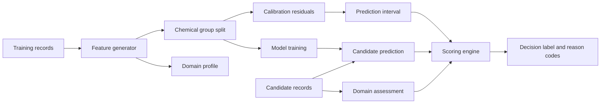
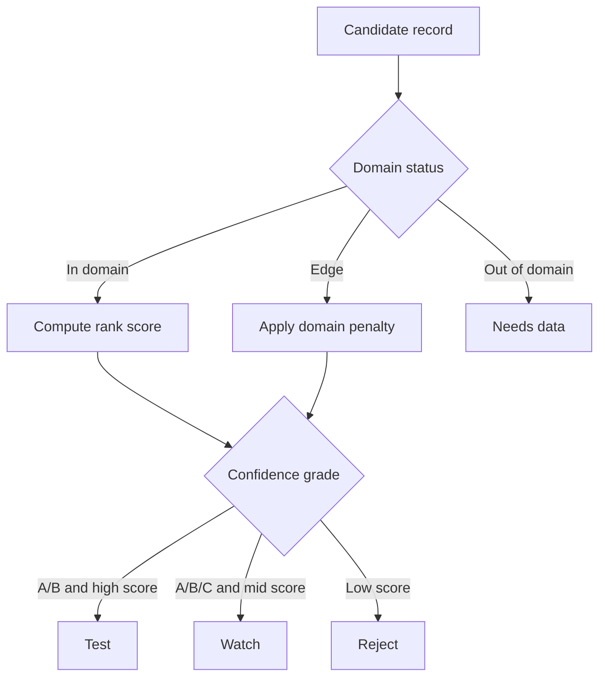

# Drawing Packet

Status: attorney-review draft, not formal patent drawings.

## Figure List

### FIG. 1 - Confidence-Gated Screening Workflow

Shows public/private experimental records entering a local screening engine. The engine performs feature generation, leakage-aware split, model training, calibration, domain profiling, candidate scoring, and decision output.

Suggested labels:

- 100: screening system
- 102: training records
- 104: candidate records
- 106: feature generator
- 108: chemically held-out splitter
- 110: model trainer
- 112: interval calibrator
- 114: domain profiler
- 116: candidate scorer
- 118: decision output

### FIG. 2 - Chemically Held-Out Training and Calibration

Shows training records grouped by solvent identity, cation identity, anion identity, or family. The figure should show that training, calibration, and test subsets do not share selected chemical group identifiers.

Suggested labels:

- 200: grouped experimental records
- 202: training subset
- 204: calibration subset
- 206: held-out test subset
- 208: selected model
- 210: residual distribution
- 212: calibrated interval parameter

### FIG. 3 - Applicability-Domain Assessment

Shows a candidate being compared to numeric training ranges and categorical chemistry values.

Suggested labels:

- 300: candidate solvent record
- 302: numeric domain profile
- 304: categorical domain profile
- 306: unseen chemistry detector
- 308: operating-window detector
- 310: domain status
- 312: reason codes

### FIG. 4 - Candidate Scoring and Decision Logic

Shows predicted value, interval width, domain penalty, uncertainty penalty, rank score, and final decision label.

Suggested labels:

- 400: predicted CO2 capture response
- 402: prediction interval
- 404: interval width
- 406: uncertainty penalty
- 408: domain penalty
- 410: rank score
- 412: confidence grade
- 414: decision label

### FIG. 5 - Local Computer Implementation

Shows local PC/workstation resources, storage, processor, memory, GPU/CPU, model files, dataset files, candidate files, and output files. The figure should emphasize that candidate structures and process data need not be transmitted to a cloud service.

Suggested labels:

- 500: local computer
- 502: processor
- 504: memory
- 506: local storage
- 508: optional GPU
- 510: model bundle
- 512: data files
- 514: candidate ranking file
- 516: audit log

### FIG. 6 - Experimental Queue Output

Shows `test`, `watch`, `reject`, and `needs_data` outputs. Candidates with `needs_data` are routed to data generation rather than positive recommendation.

Suggested labels:

- 600: candidate decision table
- 602: positive testing queue
- 604: watch list
- 606: rejected candidate set
- 608: data-generation queue
- 610: laboratory information system
- 612: capture test apparatus

## Mermaid Drafts For Counsel/Draftsman

